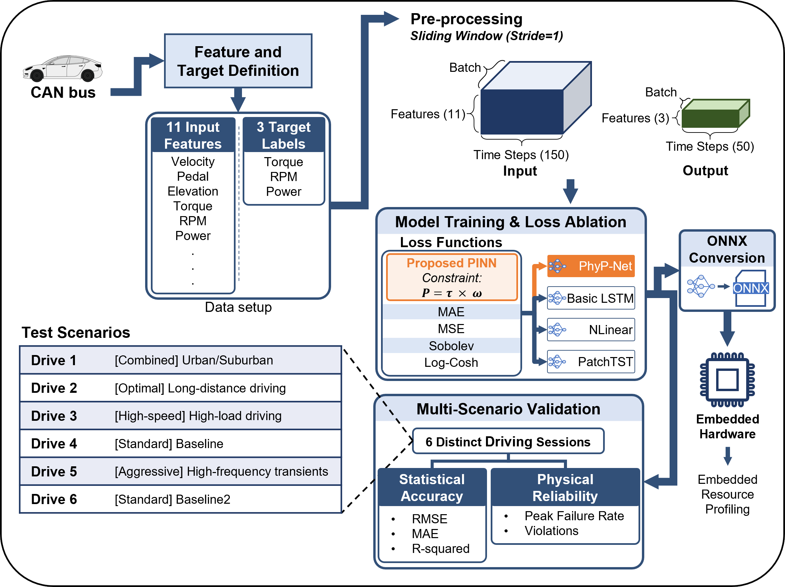

# PhyP-Net

The paper [**"PhyP-Net: Physics-Constrained Deep Learning for Sub-Second EV Power Demand Prediction in Hybrid Energy Storage Systems"**](https://ieeexplore.ieee.org/abstract/document/11579292)'s experimentation code.

## Overview

<p align="center">
  
</p>

Predicts **Power (W)**, **Torque (Nm)**, and **RPM** from a historical driving
window to forecast the near future.

**Input** — 11 features over a 150-step history window (shape `(150, 11)`):

| Layer | Feature | Symbol | Unit | Source |
|-------|---------|:------:|:----:|--------|
| Causal | Accelerator pedal position | $p$ | % | Raw CAN |
| Causal | Pedal rate of change | $\Delta p$ | %/s | Derived |
| Causal | Elevation change | $\Delta h$ | m | Derived |
| State | Motor torque | $\tau$ | N·m | Raw CAN |
| State | Motor RPM | $n$ | r/min | Raw CAN |
| State | Velocity squared | $v^2$ | m²/s² | Derived |
| State | Jerk | $j$ | m/s³ | Derived |
| Result | Vehicle speed | $v$ | m/s | Raw CAN |
| Result | Acceleration | $a$ | m/s² | Derived |
| Result | Instantaneous power | $P$ | W | Raw CAN |
| Result | Power rate of change | $\Delta P$ | W/s | Derived |

**Output** — 3 targets over a 50-step forecast horizon (shape `(50, 3)`):

| Target | Symbol | Unit |
|--------|:------:|:----:|
| Instantaneous power | $P$ | W |
| Motor torque | $\tau$ | N·m |
| Motor RPM | $n$ | r/min |

> _Data source: [Tesla Model 3 Autopilot On-road Data](https://www.osti.gov/biblio/1922211)._

## Repository Structure

```
PhyP-Net/
├── model.py              # Network architectures (LSTM, GRU, Transformer, TCN, NLinear, PatchTST)
├── dataset.py            # Dataset / data loading
├── train.py              # Training entry point
├── test.py               # Inference / evaluation entry point
├── evaluate.py           # Evaluation metrics
└── utils/
    ├── loss_function.py  # Physics-informed loss
    ├── data_spliter.py   # Train/valid/test split + normalization
    ├── processor.py      # Data normalization
    └── reshape_data.py   # Windowing / reshaping
```

## Requirements

```bash
pip install -r requirements.txt
```

## Usage

### Training

```bash
python train.py
```

### Evaluation

```bash
python test.py
```

## Model Architectures

| Model | Params | Description |
|-------|:------:|-------------|
| **PhyP-Net** (proposed) | ~64.8K | Residual LSTM encoder (h=64) + attention-based temporal pooling + multi-head predictor that splits the 50-step horizon into short/mid/long-term heads. |
| Basic LSTM | ~62.6K | Single-layer standard LSTM (h=96), many-to-one; reuses PhyP-Net's multi-head predictor to isolate the effect of the encoder design. |
| [NLinear](https://ojs.aaai.org/index.php/AAAI/article/view/26317) | ~83.1K | Channel-independent linear baseline with subtract-last normalization and a learned projection to the 3 targets. |
| [PatchTST](https://github.com/yuqinie98/patchtst) | ~66.7K | Patch-based Transformer (patch=16, stride=8, 3 layers, 4 heads) with a linear forecasting head. |

## Physics-Informed Loss

The total objective combines a time-weighted data-driven loss with the physics constraint and torque/RPM auxiliary-task losses:

$$\mathcal{L}_{\text{total}} = \mathcal{L}_{\text{data}} + \gamma\,\mathcal{L}_{\text{phys}} + \beta\,(\mathcal{L}_{\text{torque}} + \mathcal{L}_{\text{rpm}})$$

- $\mathcal{L}_{\text{data}}$ — time-weighted data-driven loss combining value and gradient terms, emphasizing far-horizon steps.
- $\mathcal{L}_{\text{phys}}$ — Huber penalty enforcing the powertrain relationship; weighted by $\gamma$.
- $\mathcal{L}_{\text{torque}},\ \mathcal{L}_{\text{rpm}}$ — auxiliary multi-task losses on the torque and RPM outputs; weighted by $\beta$.

The physics term applies a Huber penalty $H_\delta$ to the residual between predicted power and the powertrain relation $P = \tau\,\omega\,\eta$ (with $\omega = 2\pi n / 60$, drivetrain efficiency $\eta$):

$$\mathcal{L}_{\text{phys}} = \frac{1}{T_{\text{out}}}\sum_{t=1}^{T_{\text{out}}} H_\delta\!\left(\hat{P}_t - \hat{\tau}_t\,\hat{\omega}_t\,\eta\right)$$

## Results

Model comparison under each model's proposed and best-performing loss (power prediction). RMSE/MAE in kW, R² in %; **bold** = best per metric; † = best-performing loss for that model.

<table>
  <thead>
    <tr>
      <th rowspan="2">Model</th>
      <th rowspan="2">Loss</th>
      <th rowspan="2">Params</th>
      <th colspan="3">RMSE (kW)</th>
      <th colspan="3">MAE (kW)</th>
      <th colspan="3">R² (%)</th>
      <th rowspan="2">PFR (%)</th>
      <th rowspan="2">ST (samp.)</th>
    </tr>
    <tr>
      <th>0–1s</th><th>1–3s</th><th>3–5s</th>
      <th>0–1s</th><th>1–3s</th><th>3–5s</th>
      <th>0–1s</th><th>1–3s</th><th>3–5s</th>
    </tr>
  </thead>
  <tbody align="center">
    <tr>
      <td align="left"><b>PhyP-Net</b></td><td>Proposed †</td><td>~64.8K</td>
      <td><b>4.73</b></td><td><b>10.03</b></td><td><b>12.31</b></td>
      <td>2.05</td><td><b>5.08</b></td><td>7.12</td>
      <td><b>88.90</b></td><td><b>50.24</b></td><td><b>25.57</b></td>
      <td>24.01</td><td><b>5.83</b></td>
    </tr>
    <tr>
      <td align="left">Basic LSTM</td><td>Proposed †</td><td>~62.6K</td>
      <td>4.97</td><td>10.14</td><td>12.37</td>
      <td>2.38</td><td>5.17</td><td><b>6.92</b></td>
      <td>87.74</td><td>49.22</td><td>25.15</td>
      <td>40.72</td><td>7.12</td>
    </tr>
    <tr>
      <td align="left" rowspan="2">NLinear</td><td>Proposed</td><td rowspan="2">~83.1K</td>
      <td>4.98</td><td>10.59</td><td>12.91</td>
      <td>2.07</td><td>5.37</td><td>7.12</td>
      <td>87.79</td><td>45.03</td><td>18.96</td>
      <td>26.49</td><td>6.38</td>
    </tr>
    <tr>
      <td>Sobolev †</td>
      <td>4.94</td><td>10.58</td><td>12.93</td>
      <td><b>1.95</b></td><td>5.37</td><td>7.17</td>
      <td>88.00</td><td>45.13</td><td>18.68</td>
      <td><b>22.63</b></td><td>6.33</td>
    </tr>
    <tr>
      <td align="left" rowspan="2">PatchTST</td><td>Proposed</td><td rowspan="2">~66.7K</td>
      <td>7.11</td><td>11.55</td><td>13.63</td>
      <td>3.44</td><td>6.08</td><td>7.81</td>
      <td>74.94</td><td>34.38</td><td>9.55</td>
      <td>57.45</td><td>8.04</td>
    </tr>
    <tr>
      <td>MAE †</td>
      <td>6.46</td><td>11.44</td><td>13.56</td>
      <td>2.76</td><td>5.62</td><td>7.36</td>
      <td>79.25</td><td>35.25</td><td>10.26</td>
      <td>54.96</td><td>8.33</td>
    </tr>
  </tbody>
</table>

_PFR = peak failure rate; ST = settling time. PhyP-Net is the only model strong on both short-term accuracy and multi-step robustness._

> [!NOTE]
> This repository contains only the experimentation code. For the full methodology, experimental design, and detailed results, please refer to the [paper].

## License

Released under the [MIT License](LICENSE). Note that the [dataset](https://www.osti.gov/biblio/1922211) is subject to its own terms.

<!-- TODO: replace # with the published paper URL; the title and the NOTE above both link here -->
[paper]: #
